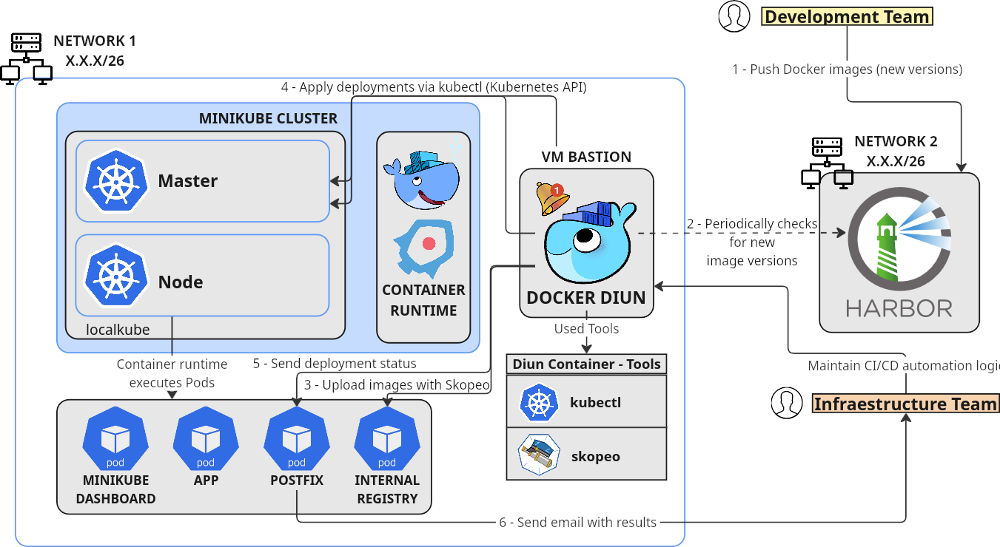
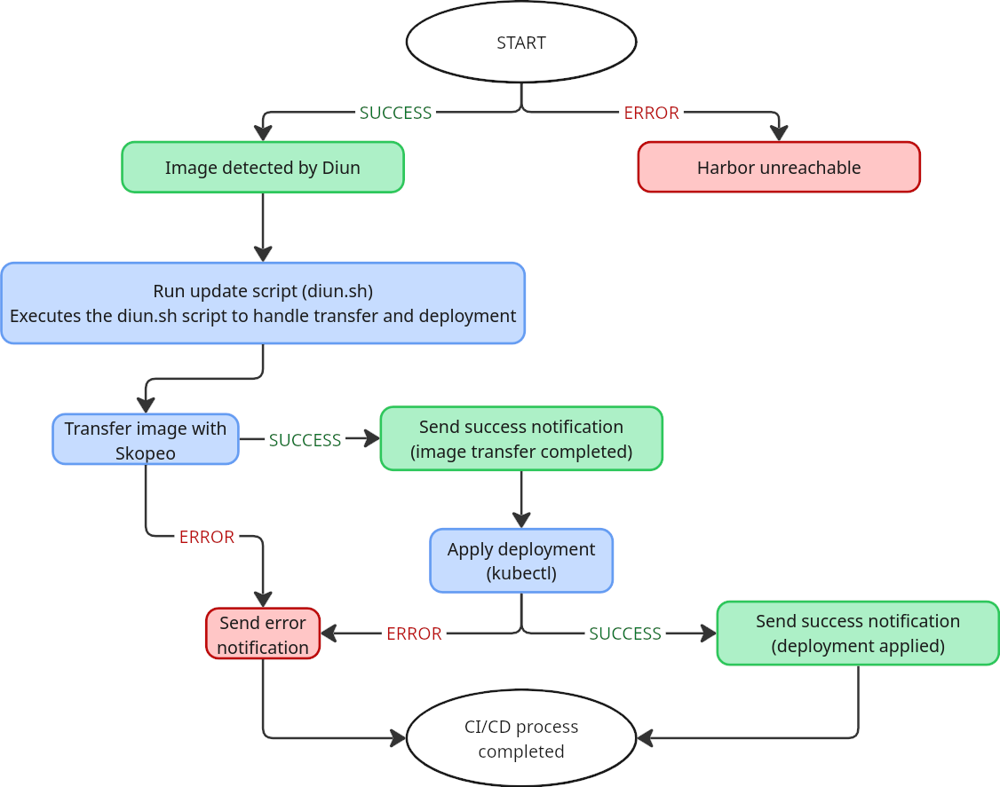

# Docker Images Automation for Isolated Kubernetes Environments

## Overview

This repository provides a **self-managed CI/CD automation framework** designed for organizations operating Kubernetes clusters under **strict network isolation policies**. The solution enables automated monitoring, secure transfer, and deployment of Docker images from an external Harbor registry to an internal Kubernetes cluster.

The system runs entirely from a **bastion host** and is designed to ensure compliance with security standards while automating workflows that traditionally require manual intervention.

It combines standard open-source tools:

* [Diun](https://crazymax.dev/diun/) for Docker image monitoring.
* [Skopeo](https://github.com/containers/skopeo) for image transfer.
* `kubectl` for Kubernetes deployment updates.
* Postfix for email notifications.

This project has been validated under real-world conditions requiring strict network segmentation.

---

## Repository Structure

This repository contains the following main directories and files:

* `demo`: Example application (`app`) and registry cleaning utilities.
* `diun`: Contains the Dockerfile and scripts for the CI/CD engine (Diun container).
* `harbor`: Scripts and configuration files to deploy Harbor as external image registry.
* `internal-registry`: Configuration for the private Docker registry running inside the Kubernetes cluster.
* `minikube`: Scripts to deploy and configure the simulated Kubernetes cluster.
* `postfix`: Helm charts and deployment scripts for Postfix notification service.
* `arch_scheme.png`: System architecture diagram.
* `flow_chart.png`: CI/CD automation workflow diagram.
* `README.md`: This file.

Each subfolder contains a `HOWTO` file with deployment instructions.

---

## System Components


### System Architecture Overview



*Figure 1: System architecture and component interactions.*


### Bastion Host

Central component where:

* Diun container runs the monitoring engine.
* Shell scripts handle image transfers and deployment updates.
* Postfix is used for email notifications.

### External Docker Registry (Harbor)

* Stores Docker images published by external development teams.
* Deployed using Helm with configuration files in `/harbor/`.

### Internal Docker Registry

* Deployed inside the Minikube-based Kubernetes cluster.
* Receives images transferred from the external Harbor registry.

### Kubernetes Cluster

* Simulated via Minikube.
* Deployments automatically updated using `kubectl`.

---

## Installation & Deployment Guide

### Prerequisites

* Ubuntu 22.04 or equivalent Linux distribution
* Docker Engine
* Kubernetes CLI (`kubectl`)
* Helm 3.x
* Skopeo
* Minikube
* Postfix (optional for real email delivery)

### 1. Internal Cluster Setup

```bash
cd minikube
./00-deploy-minikube-cluster.sh
./01-change-svc-registry-to-nodeport.sh
```

### 2. Deploy Internal Docker Registry

```bash
cd ../internal-registry
docker build -t internal-registry .
kubectl apply -f cronjob-clean.yaml
```

### 3. Deploy Harbor Registry

```bash
cd ../harbor
./deploy-harbor.sh
```

### 4. Configure & Run CI/CD Engine

```bash
cd ../diun
# Customize data/config.yml with the image to monitor
docker build -t diun-cicd .
./01-Run-Diun-Email.sh
```

### 5. Deploy Postfix (Optional)

```bash
cd ../postfix
./00-deploy-postfix.sh
```

---

## Workflow Description

The sequential CI/CD process, including error handling and notifications, is illustrated below:



*Figure 2: Automated CI/CD workflow with error handling and notifications.*

1. New Docker image version is published to Harbor.
2. Diun detects the new image via polling.
3. CI/CD scripts:

   * Use Skopeo to securely transfer the image from Harbor to the internal registry.
   * Use `kubectl` to update the Kubernetes deployment.
   * Send email notifications via Postfix after each stage.
4. All actions are logged for traceability.

Failure cases (e.g., unreachable registry, failed transfer, deployment errors) are logged and notified via email.

---

## Example Application

An example microservice (`app`) is provided under `/demo/`. It can be used to simulate external image updates:

```bash
cd demo/app
docker build -t harbor.example.net/app:latest .
docker push harbor.example.net/app:latest
```

Upon publishing, the pipeline will automatically detect, transfer, and deploy the new version.

---

## Requirements

* A pre-configured bastion host with dual network access (external Harbor and internal cluster).
* Optional: Mail relay if using Postfix in production environments.
* Proper firewall rules ensuring isolation between external and internal environments.

---

## License

**CC BY-NC 4.0**

---

## Contact and Support

For questions or support, contact:

**Sergio Laso**
[slasom@unex.es](mailto:slasom@unex.es)
